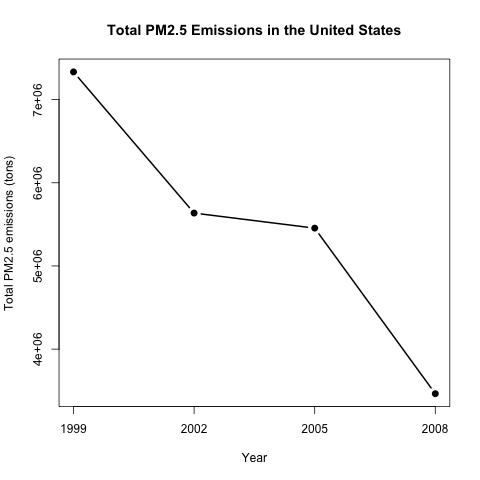
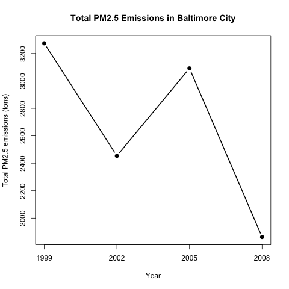
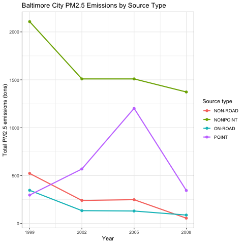
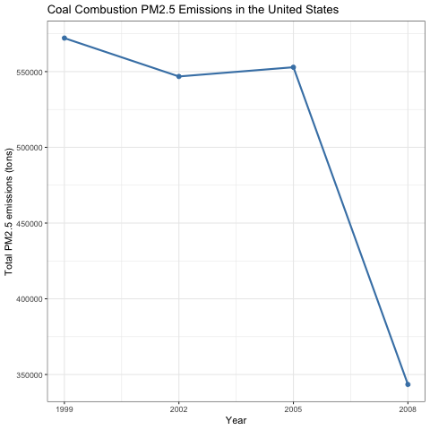
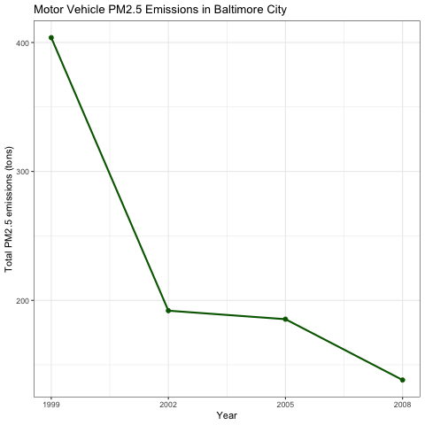
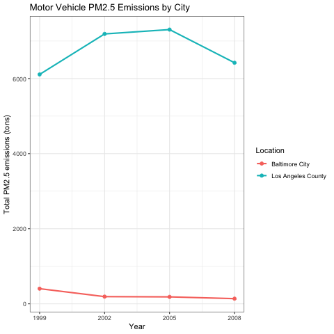

```{r setup, include=FALSE}
knitr::opts_chunk$set(echo = TRUE, message = FALSE, warning = FALSE)
```

## 1. 这份作业到底在做什么

这份作业的核心不是“画 6 张图”，而是模拟一个真实的数据分析交付流程：

1. 先理解业务指标：`Emissions` 是 PM2.5 年排放量，单位是 tons。
2. 再限定分析范围：全国、Baltimore City、Los Angeles County、煤燃烧源、机动车源。
3. 再把问题翻译成数据操作：筛选行、按年份分组、求排放量总和。
4. 最后选择合适图形：时间趋势用折线图，多类别对比用 `ggplot2` 的颜色分组折线图。

在真实业务里，这类问题常见于环境合规、运营排放监控、区域政策效果评估、行业排放源拆解等场景。你拿到的问题通常会长这样：“某地区的指标有没有下降？”、“哪类来源贡献最大？”、“两个地区变化趋势是否不同？” 解决方法基本都是：定义口径 -> 筛选范围 -> 汇总指标 -> 可视化 -> 复核结论。

## 2. 数据口径

```{r load-data}
NEI <- readRDS("summarySCC_PM25.rds")
SCC <- readRDS("Source_Classification_Code.rds")

str(NEI)
head(NEI)
head(SCC)
```

`NEI` 是事实表，记录每个县、每个排放源、每一年排放多少 PM2.5。实际分析时可以把它理解成业务流水表。

关键字段：

- `fips`：县或城市编码，例如 Baltimore City 是 `"24510"`，Los Angeles County 是 `"06037"`。
- `SCC`：排放源编码，单看数字不容易懂，需要到 `SCC` 表里查含义。
- `Emissions`：排放量，是本作业的核心指标。
- `type`：粗粒度来源类型，例如 `POINT`、`NONPOINT`、`ON-ROAD`、`NON-ROAD`。
- `year`：年份，本作业只分析 1999、2002、2005、2008。

`SCC` 是维度表，用来把 SCC 编码翻译成业务含义。凡是题目问到 “coal combustion-related sources” 或 “motor vehicle sources”，都应该从 `SCC` 表里找口径，而不是只看 `NEI$type`。

## 3. 通用分析流程

面对这类题目，我会按这个顺序处理：

1. 明确问题主体：全国、某城市、某类来源，还是两个城市比较。
2. 明确指标：这里永远是 `sum(Emissions)`。
3. 明确时间粒度：按 `year` 汇总。
4. 明确分组维度：如果题目问来源类型，就加 `type`；如果问城市比较，就加 `city`。
5. 明确图形：单条趋势用 base plot；多组趋势用 `ggplot2`。
6. 复核图是否能直接回答问题：标题、坐标轴、单位、分组图例必须清楚。

在 R 里，本作业最常用的动作是：

```{r workflow-example, eval=FALSE}
filtered_data <- subset(NEI, fips == "24510")
summary_data <- aggregate(Emissions ~ year, filtered_data, sum)
```

`subset()` 解决“我要哪些记录”，`aggregate()` 解决“按什么口径汇总”。真实工作里这一步可以替换成 SQL 的 `WHERE` 和 `GROUP BY`，或者 `dplyr::filter()` 与 `summarise()`。

## 4. 六个问题的业务翻译

### Plot 1: 全国 PM2.5 总排放是否下降

业务问题：美国整体 PM2.5 年排放量从 1999 到 2008 有没有下降？

数据动作：不筛选地区，不筛选来源，直接按 `year` 汇总所有 `Emissions`。

```{r plot1-core}
total_emissions <- aggregate(Emissions ~ year, NEI, sum)
total_emissions

```

结论：全国总排放从 1999 年约 7,332,967 tons 降到 2008 年约 3,464,206 tons，整体明显下降。

### Plot 2: Baltimore City 总排放是否下降

业务问题：Baltimore City 的 PM2.5 排放是否下降？

数据动作：先用 `fips == "24510"` 限定 Baltimore City，再按年份汇总。

```{r plot2-core}
baltimore <- subset(NEI, fips == "24510")
baltimore_emissions <- aggregate(Emissions ~ year, baltimore, sum)
baltimore_emissions

```

结论：Baltimore City 从 1999 年约 3,274 tons 降到 2008 年约 1,862 tons，整体下降；但 2005 年有一次明显回升，所以不能只说“逐年下降”。

### Plot 3: Baltimore City 哪些来源类型下降或上升

业务问题：同一个城市里，不同来源类型的排放趋势是否一致？

数据动作：仍然筛选 Baltimore City，但分组时同时使用 `year` 和 `type`。

```{r plot3-core}
baltimore_type_emissions <- aggregate(Emissions ~ year + type, baltimore, sum)
baltimore_type_emissions

```

结论：`NON-ROAD`、`NONPOINT`、`ON-ROAD` 从 1999 到 2008 都下降；`POINT` 从 1999 到 2008 是净增加，并且 2005 年峰值很高。真实分析里这一步很重要，因为总体下降不代表所有来源都改善。

### Plot 4: 全国煤燃烧相关排放如何变化

业务问题：全国范围内，煤燃烧相关源的 PM2.5 排放趋势如何？

数据动作：这不是按 `type` 分组能解决的问题，需要用 `SCC` 维度表定义“煤燃烧相关”的来源。这里使用 `SCC$EI.Sector` 中包含 `Coal` 的 SCC 编码。

```{r plot4-core}
coal_scc <- SCC$SCC[grepl("Coal", SCC$EI.Sector)]
coal_emissions <- subset(NEI, SCC %in% coal_scc)
coal_totals <- aggregate(Emissions ~ year, coal_emissions, sum)
coal_totals

```

结论：煤燃烧相关 PM2.5 排放从 1999 年约 572,127 tons 降到 2008 年约 343,432 tons，2008 年下降尤其明显。

### Plot 5: Baltimore City 机动车排放如何变化

业务问题：Baltimore City 机动车相关 PM2.5 排放是否下降？

数据动作：先用 `SCC` 表定义机动车来源，再叠加 Baltimore City 的 `fips` 筛选。

```{r plot5-core}
vehicle_scc <- SCC$SCC[
  grepl("Vehicle", SCC$EI.Sector) |
    grepl("Vehicle", SCC$SCC.Level.Two)
]

baltimore_vehicles <- subset(NEI, fips == "24510" & SCC %in% vehicle_scc)
baltimore_vehicle_totals <- aggregate(Emissions ~ year, baltimore_vehicles, sum)
baltimore_vehicle_totals

```

结论：Baltimore City 机动车排放从 1999 年约 404 tons 降到 2008 年约 138 tons，下降幅度很大。

### Plot 6: Baltimore City 与 Los Angeles County 机动车排放比较

业务问题：两个地区的机动车排放变化是否相同？谁的变化更大？

数据动作：使用同一套机动车 SCC 口径，同时筛选 `24510` 和 `06037`，再加一个可读的 `city` 字段用于作图。

```{r plot6-core}
city_vehicle_emissions <- subset(
  NEI,
  fips %in% c("24510", "06037") & SCC %in% vehicle_scc
)

city_vehicle_emissions$city <- ifelse(
  city_vehicle_emissions$fips == "24510",
  "Baltimore City",
  "Los Angeles County"
)

city_vehicle_totals <- aggregate(Emissions ~ year + city, city_vehicle_emissions, sum)
city_vehicle_totals

```

结论：Los Angeles County 的机动车排放量级远高于 Baltimore City，并且从 1999 到 2008 净增加；Baltimore City 则明显下降。如果按绝对 tons 的波动看，Los Angeles County 变化更大；如果按相对改善看，Baltimore City 的下降更明显。

## 5. 为什么有的题用 base plot，有的题用 ggplot2

题目明确要求 Plot 1 和 Plot 2 使用 base plotting system，所以脚本用 `plot()`、`axis()`、`png()` 和 `dev.off()`。这类图适合单条趋势线，代码少、依赖少。

Plot 3 题目明确要求 `ggplot2`，而 Plot 4 到 Plot 6 虽然没有强制，但用 `ggplot2` 更自然，因为它擅长多组比较、颜色映射、图例和主题统一。

选择工具时可以按这个判断：

- 单条时间趋势，且作业要求 base：用 `plot()`。
- 多条趋势线或分组对比：用 `ggplot()` 加 `aes(color = group)`。
- 需要业务分类映射：先用维度表定义 SCC 口径，再回到事实表汇总。

## 6. 交付和复核清单

本作业最终交付物应该是：

- `plot1.R` 到 `plot6.R`：每个脚本只生成对应的一张图。
- `plot1.png` 到 `plot6.png`：每张图 480 x 480 pixels。
- `PM25_assignment_walkthrough.Rmd`：这份流程说明和复盘文档。

每次提交前建议检查：

```{r qa-checks, eval=FALSE}
Rscript plot1.R
Rscript plot2.R
Rscript plot3.R
Rscript plot4.R
Rscript plot5.R
Rscript plot6.R

file plot1.png plot2.png plot3.png plot4.png plot5.png plot6.png
git status --short
```

真实项目里，这一步相当于交付前 QA：确认图能重现、文件名正确、没有把大型原始数据误提交、代码和结果能一一对应。

## 7. 碰到类似题目时怎么迁移

如果以后你遇到“某指标是否下降”的题目，先按时间分组求和或求均值，再画趋势线。

如果遇到“哪些类别上升或下降”，就在分组里加入类别变量，再用颜色区分。

如果遇到“某个业务概念没有直接字段”，例如这里的煤燃烧源、机动车源，就去找映射表或维度表，不要随便猜。业务分析最容易出错的地方不是画图，而是口径定义错了。

如果遇到“比较两个地区或两个产品”，要同时注意绝对变化和相对变化。绝对变化回答“业务量影响多大”，相对变化回答“改善比例多大”。这两个答案可能不同，Plot 6 就是一个例子。

